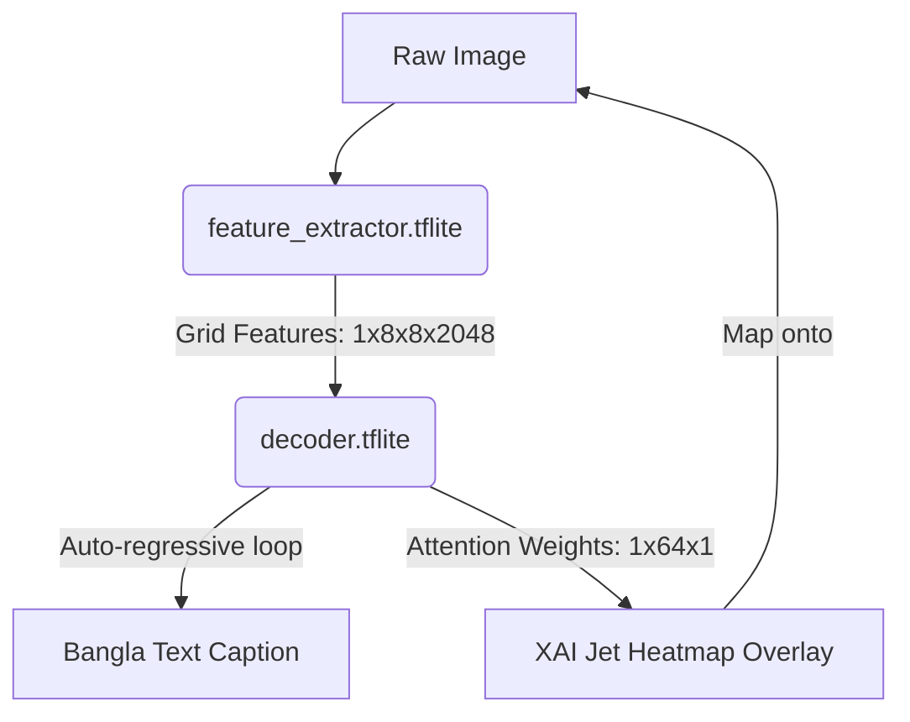

# VisionXAI: On-Device Bangla Image Captioning with Explainable AI (XAI)

This repository contains the complete source code, training pipeline, and application for **VisionXAI**, a project that runs real-time, on-device Bangla image captioning with interactive visual explanations (XAI attention maps).

The repository is structured into two main sub-projects:

1. **[Model Training & Export Capsule (`capsule-5653931`)](./capsule-5653931/README.md)**: A Code Ocean environment for training the deep learning model (InceptionV3 Feature Extractor + LSTM Attention Decoder) and converting it to TensorFlow Lite (`.tflite`) format for edge devices.
2. **[Flutter Cross-Platform Application (`vision_xai`)](./vision_xai/README.md)**: A production-ready Flutter app (supporting Android, Windows, and Web) that uses the exported `.tflite` models to generate captions locally and paint visual explanation heatmaps over the target image.

---

## Architecture Overview



- **Feature Extractor**: Built on top of `InceptionV3` (input: `299x299x3`), extracting spatial visual grids.
- **Attention-based Decoder**: An LSTM block that dynamically computes attention weights over the visual grid step-by-step to choose the next Bangla word.
- **XAI Overlay**: Generates a jet-colormap pixel heatmap that overlays exactly on the corresponding regions of the image to show which parts of the image the model focused on when generating each word.

---

## Directory Structure

```plaintext
VisionXAI-OnDeviceML/
├── README.md                 # This parent documentation file.
├── capsule-5653931/          # Python training environment & TFLite export scripts.
│   ├── code/                 # Training notebooks & export scripts.
│   ├── results/              # Output artifacts: feature_extractor.tflite, decoder.tflite, vocab.json.
│   └── README.md             # Model environment setup instructions.
└── vision_xai/               # Flutter mobile, desktop, and web application source code.
    ├── assets/               # Localized TFLite model assets & configurations.
    ├── lib/                  # Dart application logic, BLoC state, and Custom Painters.
    └── README.md             # Flutter app building and execution instructions.
```

---

## Quick Start

### 1. Train and Export Models

To train the models or generate the `.tflite` files using Docker, refer to the [Capsule README](./capsule-5653931/README.md).
The outputs will be:

- `feature_extractor.tflite`
- `decoder.tflite`
- `vocab.json`

### 2. Run the Flutter App

Copy the exported `.tflite` models and `vocab.json` into `vision_xai/assets/` and follow the [App README](./vision_xai/README.md) to run it locally on Android, Windows, or Chrome:

```bash
cd vision_xai
fvm flutter pub get
fvm flutter run
```
